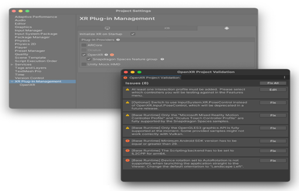
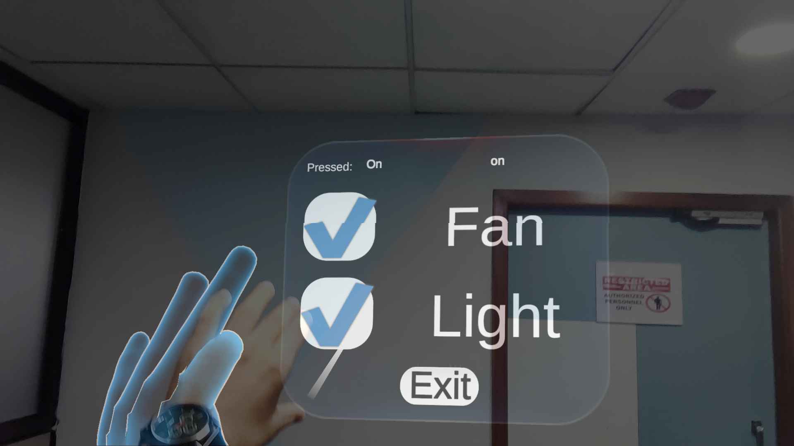

# Gesture-based AR application to control device : Smart Home Automation
## Introduction
The objective of this project is to develop an augmented reality (AR) based smart home automation application by integrating Lenovo ThinkReality AR glasses with the XR Interaction Toolkit from Snapdragon Spaces Augmented Reality SDK for Android. These AR glasses offers an immersive augmented reality display, while the XR Interaction Toolkit provides precise Hand Tracking and Gesture Recognition capabilities. The Snapdragon Spaces SDK enables effortless integration with the smart home system, allowing users to effortlessly control and manipulate smart devices using intuitive hand gestures, thereby enhancing the overall smart home experience. 
## Prerequisites 
- Install Unity hub with Unity game engine 2021.3.23f1 

- Download and install the Snapdragon Spaces™ Extended Reality SDK tool kit 

- Setup  XR toolkit from snapdragon spaces inside unity project. 

https://spaces.qualcomm.com/sdk/


 
## 2. Steps to create project in Unity   


- Download Unity hub.
  Refer link :- https://unity.com/download

- Download Unity Software  from Unity HUb . and install  All modules that already installed in this image.<br> 
    <div align="center">  
    
    </div>

-  Open Unity Hub -> open Project -> Add project from disk -> select file <br>
    <div align="center"> 
    
    </div>

- Import the Snapdragon Spaces package: 
    1. Unity snapdragon Spaces SDK Snapdragon Spaces for Unity SDK  (mandatory to create account) 
        download link: https://sso.spaces.qualcomm.com/?redirectUri=https:%2F%2Fspaces.qualcomm.com%2Fdownload-sdk&lang=en 
        package will be download as a tarball file. 
        
    2. Import XR hand Interaction Toolkit that is downloaded from snapdragon space.  
        Find option in windows -> Package manager -> Add Package from tarball. (Upload both .tgz file)<br>
        <div align="center"> 
        
        </div>

    3. To enable the Snapdragon Spaces OpenXR Plug-in, navigate to the project settings under Edit -> Project Settings -> XR Plug-in Management and open the Android tab. and click on Fix All button for fixing all errors<br>  
        <div align="center"> 
        
        </div><br>

    4. Enable Spaces features like: Base Runtime, Camera Access, Hand Tracking, Hit Testing. Image Tracking, Pane detection. spatial Anchors, Spatial Meshing 
    <div align="center"> 
    
    </div>
        
    5. Import Core Samples 
        The Snapdragon Spaces SDK package is shipped with sample assets to showcase how to use the perception features included in the package. To import them, pick the package in the package manager (located in the menu bar under Window -> Package Manager) and import on the Core Samples.<br> 
        <div align="center"> 
        
        </div>
    6. Build Scene in unity 
       a. After importing samples, Use helper tool to add the sample scenes to the build settings by clicking Window -> Snapdragon Spaces -> Add Scenes to Build Settings in the menu bar.
        <div align="center"> 
        
        </div><br>
        with onClick event aws cloud server will forward the query to the Raspberry pi.
        <div align="center"> 
        
        </div>
       b. Enable Hand Tracking feature <br>
        <div align="center"> 
        
        
        </div><br>Note: all this actions will be default if u clone repository


- For change AWS configuration inside App project layout   
      Go Assets -> scripts -> Button controlles.cs <br>
    <div align="center"> 
    
    </div>

- Open this File for Backend connection with aws  iot core to send/receive query. 
  Change AWS Access Key, Secret Key, IoT Endpoint:

```c#
 public void Start () 
    { 
        try  
        { 
            iotClient = new AmazonIotDataClient( 
            "<Use here AWS Access key>", 
            "<Use Here AWS Secret Key>", 
            "<Use Here AWS IoT Endpoint URL" 
                ); 
            Debug.Log("AWS IoT client initialized successfully."). 
        }  
        catch (Exception e)  
        { 
            Debug.LogError("Error initializing AWS IoT client: " +e. Message); 
        } 
    }     
```

- Finally Save code and build application with XR toolkit  

  go to File > Build setting > Select Android > Build 
  in build setting we need to select Scenes/Menu and Scenes/MainScence 
    <div align="center"> 
    
    </div>
- This will create .apk file at your specified location. 
  
  
  
  
  
### 2.2 Run Application inside Android  
1. Open Setup Snapdragon Spaces Services application inside Android mobile. 
    a.	 To get snapdragon Spaces Services Apk follow this .
        1. Download one of the available SDKs from the Dev Portal (opens new window)and extract them to a local folder.
                https://sso.spaces.qualcomm.com/?redirectUri=https:%2F%2Fspaces.qualcomm.com%2Fdownload-sdk&lang=en
        2. Install the adb package using: sudo apt install adb. 
        3. Connect the mobile phone using USB cable and turn on USB debugging in the phone. 
        4. Find the Snapdragon Spaces Services .apk at the top level of the extracted folder and install it in android phone using following command:
            adb install  /<path>/SnapdragonSpacesServices_<version> .apk

    b. After device verification, Spaces Apps are now ready to be installed and tested on the device. 
    <div align="center">
    
    </div>
    
2. Connect AR glasses with Android phone and setup AR glasses and install application that previously build in unity by using command: adb install filename.apk.
    https://docs.spaces.qualcomm.com/common/setup/ThinkRealityA3Setup.html


3. Run application using AR Glasses. 
   a. To open filename.apk follow this.
    1. Open companion application in android mobile by connecting glasses 
    2. Move to HandInteraction >> Open App<br>Note: Allow required permissions for the app.
    <div align="center"></div>
    3. This will display menu which contain start button click on start by pinch of hand
    <div align="center"></div>
    <div align="center"></div>
    4. After this step, it will display panel that contains fan and light check box menu
    <div align="center"></div><br>
    5. to turn on/off light click on light check box by pinch of hand <br>
    <div align="center"></div><br>
    <div align="center"></div> <br>
    6. to turn on/off fan click on fan check box by pinch of hand <br>
    <div align="center"></div><br>
    <div align="center"></div><br>
    <!-- <br> to turn on/off both light and fan<br>
    <div align="center"></div>
    <div align="center"></div> -->