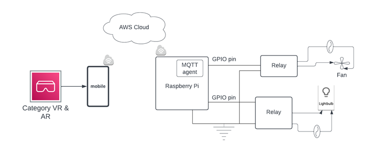
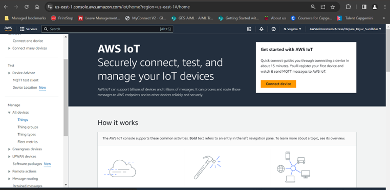
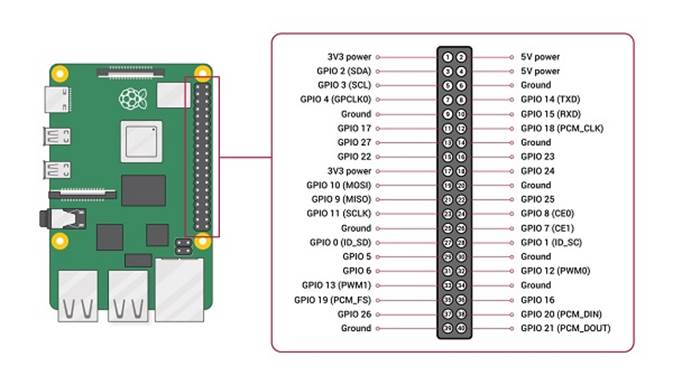
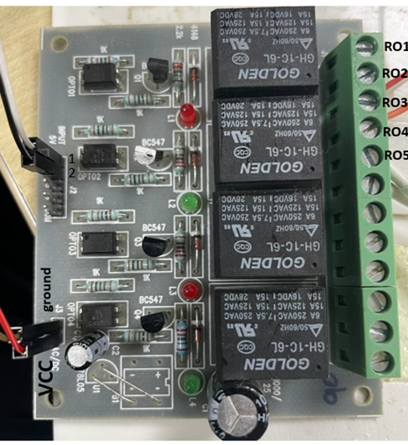
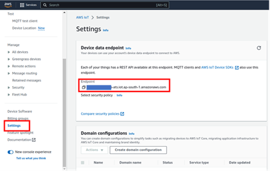

# Gesture-based AR application to control device : Smart Home Automation

## Introduction
The objective of this project is to develop an augmented reality (AR) based smart home automation application by integrating Lenovo ThinkReality AR glasses with the XR Interaction Toolkit from Snapdragon Spaces Augmented Reality SDK for Android. These AR glasses offers an immersive augmented reality display, while the XR Interaction Toolkit provides precise Hand Tracking and Gesture Recognition capabilities. The Snapdragon Spaces SDK enables effortless integration with the smart home system, allowing users to effortlessly control and manipulate smart devices using intuitive hand gestures, thereby enhancing the overall smart home experience. 

 

 
## Prerequisites 
- Setup Raspberry-pi that connects with bulb and fan through relay as shown in below figure.<br><br>


- AWS thing credentials.  

 


## Installing Dependencies  
1. Login with AWS IAM user and open AWS thing creation steps: 

    1.1 AWS ->  aws iot core -> All devices (on left side menu) -> Things -> Create Things (Top right corner) -> Create Single Thing 
<br>

<br>
    
    1.2 Enter thing name and click next 
    1.3 Select auto generated and click next 
    1.4 If no  policy is selected, then select a policy with all permissions
    1.5 Creation of policy:  

        1.5.1 IoT Core home page -> Security (left side menu) -> Policies -> Create policy 
        1.5.2 Provide policy name  
        1.5.3 Under policy document give following details: 

            a. Policy Effect: Allow 

            b. Policy action *   (All) 

            c. policy resource: * (ALL) 

        1.5.4 Click on create 

        1.5.5 Go to AWS thing  and Select the created policy and click create thing 
    1.6 Download the certificate and keys 

    1.7 Download device certificate  
        NOTE: This is the only time you can download the key files for this certificate. public and private keys 

    1.8 Download private and public keys 

    1.9 Download Amazon root ca1 certificate 


    

### After successful completion of all steps, your AWS thing is created  


```sh

Topic: - <Use Your AWS Topic name> 

Data: -  

{ 
  "location": "BT-Beacon_room1", 
  "devices": { 
    "light": { 
      "status": "on/off", 
      "ack": "true", 
      "err_msg": "" 
    }, 
    "fan": { 
      "status": "on/off", 
      "ack": "true", 
      "err_msg": "" 
    } 
  } 
} 

```

### Setup Raspberry-pi:  
- Steps for establishing hardware connection:  

    1. Use jumper wire to connect the 2nd pin (5v op) of Raspberry PI to RO2 pin of relay board.  

    2. Connect Fan's +5v pin to RO1 pin of relay board.  

    3. Connect 14th (Ground) pin of Raspberry PI to Fan's ground ping.  

    4. Connect the 4th (5v op) pin of Raspberry PI to Vcc of relay board.  

    5. Connect 6th (Ground) pin of Raspberry PI to ground of relay board.  

    6. Connect 38th (GPIO20) pin of Raspberry PI to 1st input pin of relay board.  

    7. Connect 40th (GPIO21) pin of Raspberry PI to 2nd input pin of relay board.  

    8. Connect Bulb as shown in diagram where one of the supplies will directly connect with bulb and another will connect through the relay.





- Setup Resource Access Management user for Access key and Secret key and for detailed setup please refer to https://docs.aws.amazon.com/IAM/latest/UserGuide/id_credentials_access-keys.html 

- Note that the AWS IoT endpoint can be obtained in AWS IoT core console in settings section. AWS IoT Console >> Settings <br>



- Steps to prepare device with required python scripts. Download AR-smart-home.py, command_line_utils.py and Falcon_db.txt from the provided github source link and upload this file in raspberry pi (via USB) inside smart_home folder. Use the certs downloaded at step 1.6- 1.9. and Use Your AWS EndPoint.
 

```sh
$ cd /home 
$ mkdir smart_home 
$ cp AR-smart-home.py smart_home/ 
$ cp command_line_utils.py smart_home/ 
$ cd smart_home/ 
```

This command is used to run a script on an edge device or platform, and the script is designed to manage home devices. 

```sh
$ python3 AR-smart-home.py --endpoint < end point > --ca_file ~/ap_south_1_new_aws_cert/<root cirtificat> --cert ~/ap_south_1_new_aws_cert/ap_south_1_Room-1_RB5.cert.pem --key ~/ap_south_1_new_aws_cert/<private key> --client_id basicPubSub 
```